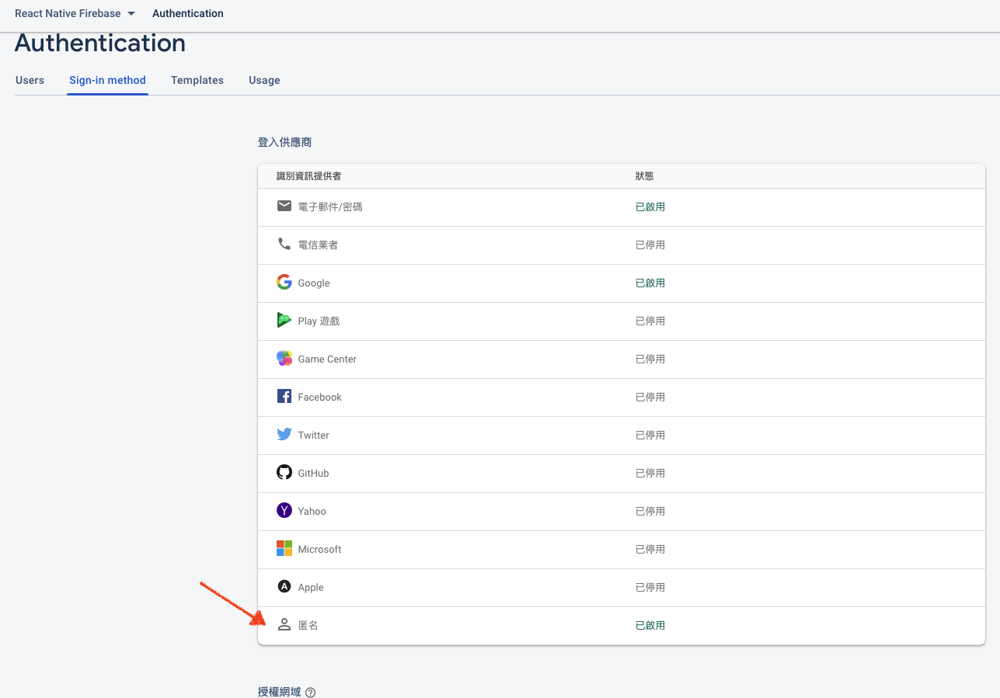
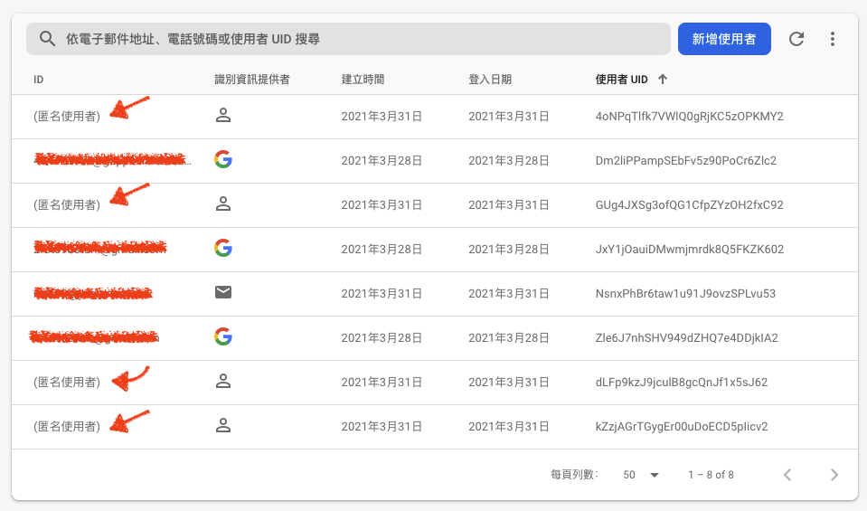

## 什麼時候需要匿名登入？

操作 app 時
其實不一定需要用戶「真的」登入
我們可以在使用者第一次使用 app 時讓他(或自動)匿名登入
如此一來就能在用戶不提供個資的情況下紀錄他的活動
例如 加入購物車

在 firebase 匿名登入很簡單
首先到 firebase console 開啟匿名登入的功能



接著再 app 中使用：

```javascript
firebase.auth().signInAnonymously()
```

與其他登入方式相同，我們可以建立 user state listener

在用戶登入的時候獲取的用戶資訊

如 uid 之類的

```javascript
firebase.auth().onAuthStateChanged((user)=>{
	if (user){
		console.log('uid: ',user.uid)
	}
	})
```

匿名登入有個問題，如果有個用戶一直登入登出，這會導致匿名帳號不斷被建立，像這樣：

	

所以比較好的做法是：當用戶要登出匿名帳號時，一併把他的帳戶從後台刪除

雖然 firebase 的用戶數限制很高

但養成後台乾淨整齊的習慣還是很重要的

## 轉換成實名帳戶

用戶在匿名登入一段時間後，也許他們覺得不錯想要註冊

這時我們就要提供轉換帳戶的功能 

首先製作 credential

- #### Email

```javascript
const credential = firebase.auth.EmailAuthProvider.credential(email, password);
```
- #### Google

```javascript
var credential = firebase.auth.GoogleAuthProvider.credential(
  googleUser.idToken,
  googleUser.accessToken
);
  ```

接著用 `firebase.auth().currentUser.linkWithCredential(credential)`

```javascript
const auth = firebase.auth()
auth.currentUser.linkWithCredential(credential)
  .then((usercred) => {
    var user = usercred.user;
    console.log("Anonymous account successfully upgraded", user);
  }).catch((error) => {
    console.log("Error upgrading anonymous account", error);
  });
```


## references

- ### [Firebase - Authenticate Anonymously](https://firebase.google.com/docs/auth/web/anonymous-auth)

- ### [Firebase - Conver an Anonymous Account to a Permanent Account](https://firebase.google.com/docs/auth/web/anonymous-auth#convert-an-anonymous-account-to-a-permanent-account)
