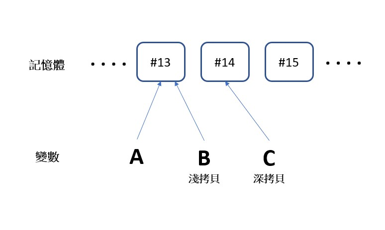

<font size="2" color="#aaa">

## <font color="#f4a261">前言</font>

這次要講一個我在做專案時一直被他搞死的概念
深拷貝與淺拷貝
雖然已經知道這個概念
相關文章也看到好幾次了
但每次還是會在專案中卡好久好久找不到 bug
最後才發現說：「啊 原來又是這個問題啊」

## <font color="#f4a261">Call by value/reference</font>

首先要釐清的觀念是 call by value 跟 call by reference

> <font color="gold">在 javascript 中物件是採用 call by reference</font>

也就是例如當你把已存在記憶體中的物件指派到`a`變數時
`a`會指向該記憶體位置，而不是複製其值
讓我們看個例子

```javascript
const A = {num: 1}
const B = {num: 1}
const C = A
console.log(A===B) // false
console.log(A===C) // true
```

當我互相比較這三個物件時
會發現`A`和`B`明明內容相同，卻回傳 false
只有當`C`是從`A` assign 來的時候才得到 true
因為其實 A 和 C 是共用同一個記憶體
而物件的比較是去看記憶體位置
所以得到 true
而`A`和`B`雖然內容一樣，卻因為都是新創的物件
他們會占用不同的記憶體位置
對 JS 來說就是不一樣的囉

## <font color="#f4a261">淺拷貝</font>

上述的 `const C = A` 就是淺拷貝的一種
他沒辦法做到完全的複製
而是在「某程度」上保有指向相同記憶體的特性

```javascript
const A = {num: 1}
const B = A
console.log(A,B) //{num: 1}, {num: 1}
A.num = 10
console.log(A,B) //{num: 10}, {num: 10}
```
我只更動`A`，結果`B`的內容也改了
很多時候出現 bug 就是因為這個原因

至於剛剛為什麼要強調「某程度」呢?
因為有些做法只能在第一層上進行深拷貝
當你的物件結構更複雜時就會出問題
來看一個被誤以為是深拷貝的技巧 spread operator

```javascript
const A = {num: 1}
const B = {...A}
console.log(A,B) //{num: 1}, {num: 1}
A.num = 10
console.log(A,B) //{num: 10}, {num: 1}
```

看似沒問題，但如果改成二階以上的物件的話...

```javascript
const A = {num: {ch: '一'}}
const B = {...A}
console.log(A.num.ch, B.num.ch) // "一", "一"
A.num.ch = '四'
console.log(A.num.ch, B.num.ch) //"四", "四"
```

另外還有一個做法是 `Object.assign()`
但結果跟解構賦值一樣
僅限於一階物件

## <font color="#f4a261">深拷貝</font>

我個人最喜歡的作法是用`JSON.stringify`和`JSON.parse`
直接把物件文字化再物件化一次
就一定會是另一個物件了
達到深拷貝的效果，像這樣:

`const B = JSON.parse(JSON.stringify(A))`

或是如果嫌每次都這樣寫麻煩
可以在專案中定義一個 deepClone function

```javascript
const deepClone = (obj) => JSON.parse(JSON.stringify(obj))

const A = {num: {ch: '一'}}
const B = deepClone(A)

console.log(A.num.ch, B.num.ch) //"一", "一"
A.num.ch = '四'
console.log(A.num.ch, B.num.ch) //"四", "一"
```

## <font color="#f4a261">結論</font>

> <font color="gold">淺拷貝: 看似複製，其實是指向相同位址</font>
> <font color="gold">深拷貝: 另用一個記憶體存值，實質意義上的複製</font>

