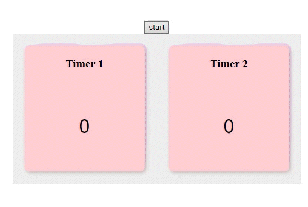

<font size="2" color="#aaa">

## <font color="#f4a261">前言</font>

上一篇介紹了 scope
這篇就來介紹一個平常都在用卻又不怎麼熟悉的概念 closure

## <font color="#f4a261">閉包 Closure</font>

Closure 光看單字就有種關了什麼起來的感覺
沒錯，閉包一言以蔽之就是

> 閉包會記住函式建立時的環境

也可以當作把環境鎖起來，關在閉包當中
如此一來當同時建立很多函式時，便能讓他們互不干涉
我們先從下面的例子來觀察閉包的基本行為

```javascript
const name = 'Tony'

const greeting = () => {
  console.log(name)
}

greeting()
```

我們並沒有將`name`這個變數傳入greeting中
為什麼還是印的出來呢?
正是因為當執行 greeting 函式時
它會記住建立 greeting 函式時當下的環境(`name`就在其中)
所以不會找不到
這個例子非常簡單，甚至平常都不會注意到這就是閉包
來看個特殊疫點的例子，巢狀函式

```javascript
const counter = (num)=>{
	const show = ()=>{
  	console.log(num++)
  }
  return show
}

const add = counter(1)

add() // 1
add() // 2
add() // 3
```

首先定義一個 counter 函式，會回傳一個內部函式 show
接著建立一個新函式 add 傳入 1 作為初始值
每次運行 add 時
參數 num 就好像偷偷被存起來一樣
每次都記得，不會被重置
原因就是每當函式被建立時，就會產生一個閉包
之後連續運行三次 add，用的都是相同的閉包
因此變數也得以保留

## <font color="#f4a261">非同步函式的例子</font>

在下面的例子中
我做了兩個 timer
並連 call 兩次 start 使他們開始運轉
能看到這兩個 timer 各自成一家，自己數自己的




```javascript
const timer1 = document.querySelector('.timer1')
const timer2 = document.querySelector('.timer2')

// let counter = 0 //如果在這定義 counter，會變成被所有 start 共用的變數

const start = (timer, time) => {
  // 每次運行 start，這裡的環境就會被存成一個閉包
  let counter = 0
  const tick = () => {
    counter++
    timer.innerText = counter.toString()
  }
  setInterval(tick, time)
}

const startButton=document.querySelector('.start')
startButton.onclick = ()=>{
  start(timer1, 1000)
  start(timer2, 500)
}

```

每當 start 被呼叫時
記憶體中的某處就會空出一個位子給 counter 變數
當我又呼叫一次 start，又會有一個 counter 的位子
這些 counter 互不干涉
這就是閉包的效果

此範例的完整 code 請見 [我的 codepen](https://codepen.io/roto93/pen/YzaYbVg)

## <font color="#f4a261">結論</font>

#### 閉包 Closure: 
1. 是函式與建立函式當下的環境的集合 
2. 會使函式記住宣告它當下的環境
3. 能讓函式被多次呼叫卻又互不影響
