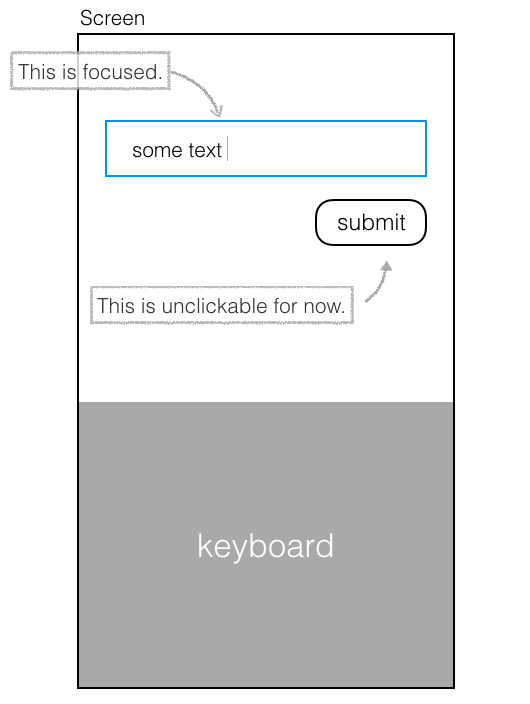

在做 SideProject 時很常遇到一個狀況
TextInput 在 Focus 狀態時，是沒辦法立刻觸發其他按鈕的
你必須先點擊螢幕一次 (TextInput和鍵盤以外的地方)，將鍵盤收起
才能觸發別的按鈕
其實不只是按鈕，其他需要 recieve touch 的元件也有這個問題



至於為什麼強調是在做 sideProject 的時候呢?
因為這在一般情況不太算是問題
直到我以使用者的角度來操作app時才發現
當我預期點擊按鈕有用時，結果居然只是給我收起鍵盤而已?
真的很煩躁啊!我的耐心都到哪去了
這時我才了解使用者經驗的精隨
任何操作都要有預期的效果
只要有任何一次的點擊失效
負評的心情就來了

回到問題本身，會有這個限制我想是因為輸入文字跟顯示鍵盤這兩件事是密切相關的
該輸入文字的時候就該顯示鍵盤
不打算輸入文字的時候就關閉鍵盤
在流程操作上比較直觀
但就像我說的，這不符合使用者的直覺
那該怎麼控制呢?

## <font color="#BC2C1A">ScrollView 來幫個忙</font>

---

ScrollView 有一個屬性是我們需要的
叫做 `keyboardShouldPersistTaps`
一句話解釋:鍵盤打開的時候要不要接收觸控訊號?

可以設定三種值:
`'never'`: 當子元件的 TextInput focus 時，點擊文字框和鍵盤以外的地方會關閉鍵盤，當這件事發生時，子元件不會接收到 tap
`'always'`: 鍵盤不會自動收起，ScrollView 不會接收到 tap (但可以滑動)，子元件可以接收到 tap
`'handled'`: 如果 tap 被子元件或父元件 catch，鍵盤不會自動收起；但如果是被 ScrollView catch，鍵盤還是會收起來。

所以策略是這樣的
我們可以將此屬性設為`'handled'`，先防止鍵盤自動關閉
這時按鈕就能互動了
接著再手動控制鍵盤關閉的時機就好
控制鍵盤的方式是用 react native 的`Keyboard`API

```javascript

import {ScrollView, Keyboard} from 'react native'

<ScrollView keyboardShouldPersistTaps="handled">
  <TextInput/>
  <TouchableOpacity/>
</ScrollView>

```

正當我以為沒問題的時候來了個小插曲ˋˊ

## <font color="#BC2C1A">檢查上層了嗎?</font>

---

在某一次我完成這些設定後卻發現沒效果!? 按鈕還是不能按
經過一番研究後終於知道了
設定沒效果代表在此元件之上一定還有另一層沒設定的 ScrollView
所以只要找到該標籤，加上`keyboardShouldPersistTaps`的屬性就可以了
記得要一路檢查到 root 哦

