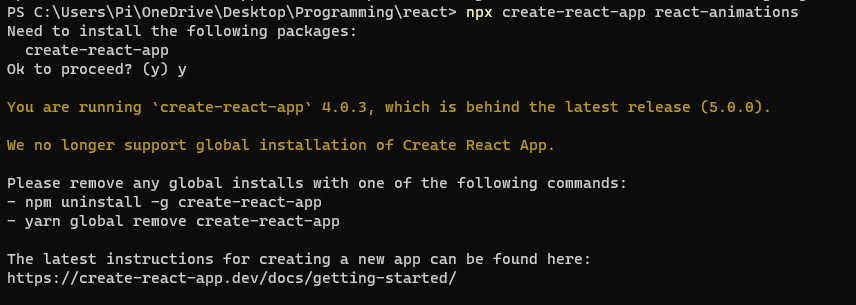

## 前言

整個過年期間後有點小荒廢
於是決定做一些 react 的小 project 練習一下
結果在初始化專案就卡住...

第一行說需要安裝create-react-app
我就覺得怪怪的
之前明明就用過啊
指令也下得一樣
怎麼突然要下載

當時也沒繼續多想就直接按下 y 繼續
結果還是沒執行
這裡有一句非常關鍵: 
> We no longer support global installation of Create React App.

根據官方文件，現在不支援用全域安裝的方式來執行了
原因是要讓大家盡可能使用最新版本
所以之後每次執行`npx create-react-app`時
都會當下下載最新版來用

## 還沒結束

所以我照他的只是把電腦上全域安裝的 create-react-app 移除
但結果完全一樣
我已經檢查過電腦上已經沒有裝了
只好再次求救 google

後來發現是因為 npx 的 cache 要清除
只要執行 `npx clear-npx-cache` 就可以了

## 結論

官方呼籲大家盡早把自己電腦上的全域套件移除
以後要建立新的 react 專案
不能再用全域套件來創了
但初始化指令不變
一樣是 `npx create-react-app <your-app-name>` ㄛ

