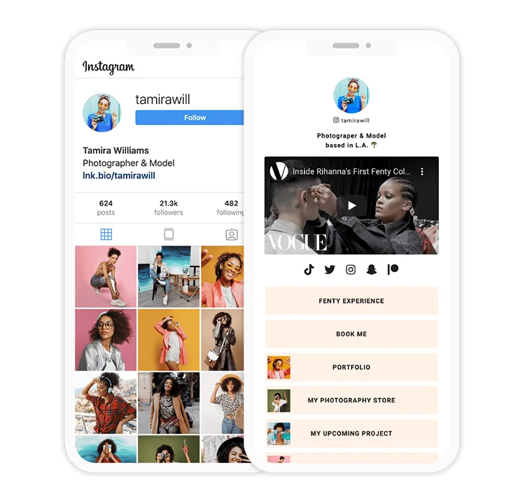
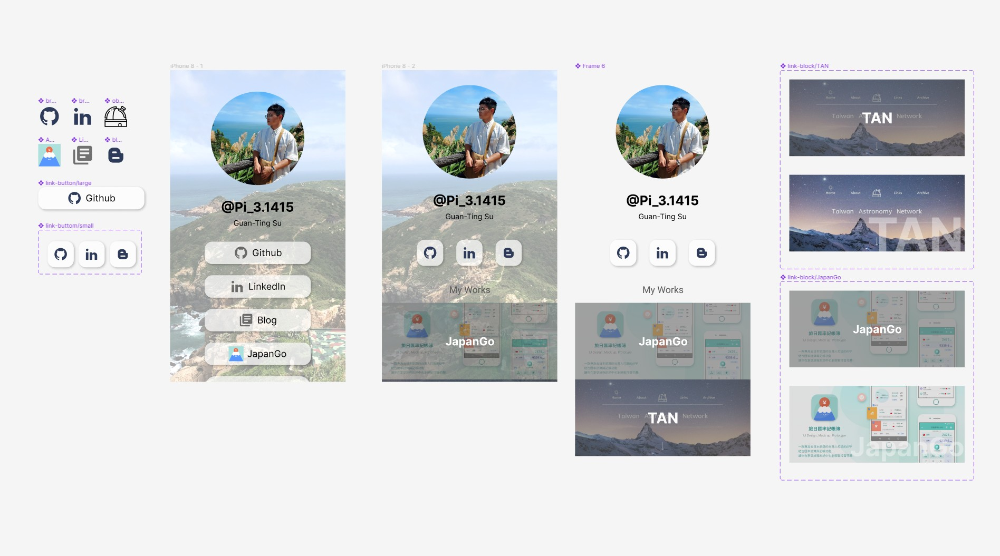
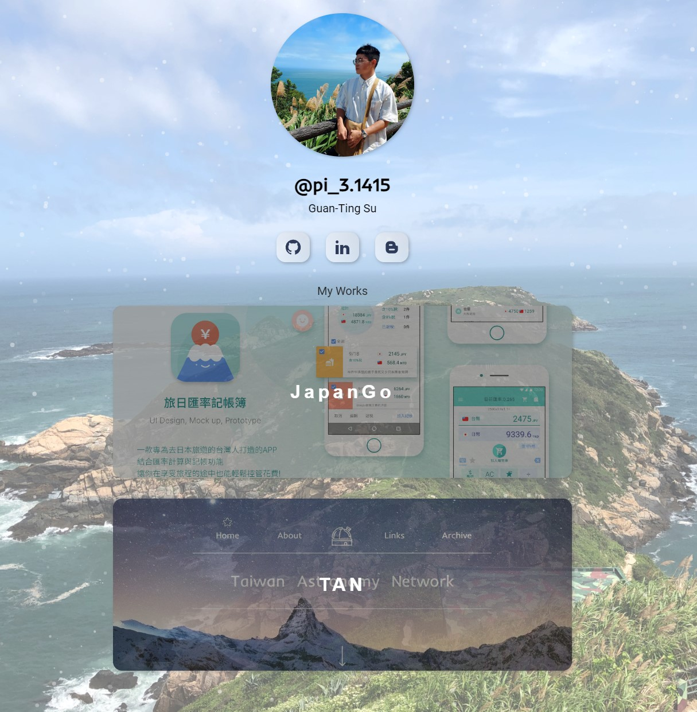

## 前言

3~6 月國軍 online，一般來說還有周休二日可以碰碰電腦，練練程式
但沒想到居然如願以償去馬祖當兵
身為外島兵，整個下部隊期間只有放一個大約十天的返台假有機會用到電腦
所以我也只能利用平常的空閒時間看看工程師YouTuber的影片
以及看一些書面資料，盡量讓自己不要退步太多
現在終於退伍了
趕緊做點小東西讓自己回歸手感

契機是發現越來越多人會在IG的個人首頁放上連結頁
因為只能放一個連結
如果有很多連結想放的話
可以用像是 [linktree](https://linktr.ee) 或 [Lnk.Bio](https://lnk.bio/zh-tw/) 這類的服務
快速生成連結網站

用這種簡單的網站作為暖身
應該還行哈哈
同時也能為自己的履歷做準備

## 設計

首先我先列出一個連結頁要有的內容:

1. 頭像
2. 姓名、用戶名
3. 連結

然後一一思考我想要這些元素怎麼呈現
並把需要的素材找齊
然後就可以來拉畫面了

首先最左邊是 icon、按鈕元件
再來向右邊走分別是第一版的畫面、
第二版的畫面、
為了達到頁面滾動時背景固定而做的元件，
以及作品區塊元件 ( hover 前後的兩個 state )

第一版就是依照大部分聯結頁的排版來做
實際上我也是先做好這個
才覺得想要再做得更特別一些

第二次設計時
最先冒出的想法是想把每個按鈕都變成區塊狀的
並且可以直接看到內容縮圖
有點像作品集的感覺
但後來決定只將最後兩項採用這個做法
原因是前三個連結其實都不太需要畫面呈現
就算硬要擠出一張圖也只是點進去之後的截圖而已
意義不大 又搞得整個畫面太豐富
因此只把真的是作品的做成區塊
Github之類的連結就保持簡潔即可
最終成了第二版

## 實作的過程

其實沒遇到什麼困難，但有一點很困擾
那就是 CSS 變得好不熟 XD
果然就算之前已經用的蠻順手的了，空窗個四個月還是會忘掉一大堆
真是幸好有做這個小網站
才讓我的記憶慢慢回歸

在這個網站中用到兩個動畫 library
Vanta.js 用來在背景中加入雪花動畫
tilt.js 在頭像加上隨著游標晃動的特效
對一個工程師來說
懂得如何快速運用現成的library
貼過來的程式碼出錯需盡快修正
也是很重要的技能

另外這個網站沒有複雜的 RWD
基本上我只要確保在大小裝置都不要破版就好了
不需要調整到排版
所以我採用 mobile-first 的開發模式
先以小裝置螢幕來設定 CSS
便能避免視窗更動時發生嚴重破版
最後再根據大螢幕做些許調整

## Mobile-first 的心得

曾經在 CSS 教學影片中看到兩個觀念
「網頁在還沒加上任何 CSS 前，就是 RWD」
mobile-first 的用意就是先做出CSS規則較少的手機版網頁
再用 media query 為相對較複雜的電腦版多加幾個規則
如果順序調過來的話
等同於先為了做網頁版添加很多規則
再為了手機板用好幾行新規則蓋過去
豈不是多此一舉

所以現在如果是我自己要從頭開發新專案
都會盡量先從手機版開始設計&開發
目的便是減少開發時程與複雜度

## 成品

完成的網頁在 [這裡](https://insta-profile-page-4f7d8.web.app)
雖然說不上多厲害
但用自己做出來的東西
果然還是比較開心

