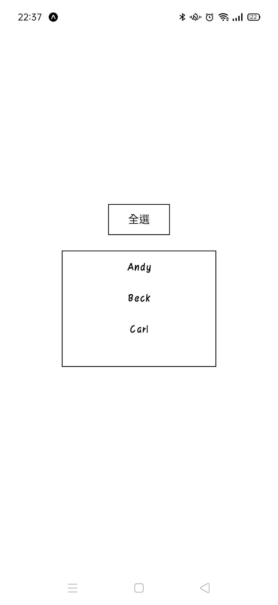
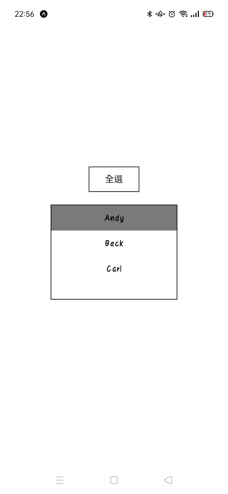
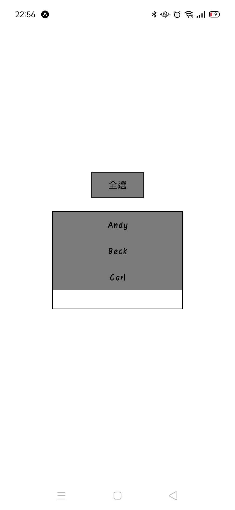
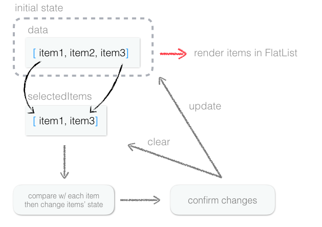
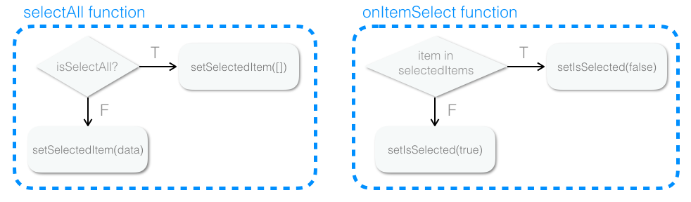
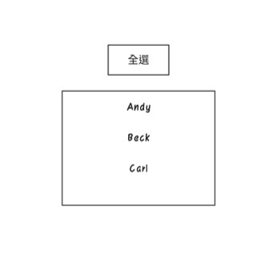

這篇會示範如何實作購物車app常有的全選功能

之前曾經用錯誤的方式做導致卡住
而且腦筋轉不過來
一時想不到其他變通方式
只好到社團問
一問才發現其實很容易
不過應該很多事情都是這樣啦
不懂的時候就好像很難
會了之後就覺得自己好蠢XD

---

首先做出選單
假設 MOCK 是我們資料庫的資料，或是從api獲取的資料
data state 是我們的資料變數
之所以先把資料放在 react state 中
是因為傳入 FlatList 的資料必須是能夠變動的
這樣我們只要改變資料
就能動態渲染在FlatList中


```javascript

const MOCK = [
  { name: 'Andy' },
  { name: 'Beck' },
  { name: 'Carl' },
]

const RenderData = ({ item }) => {

  return (
    <TouchableOpacity
      onPress={() => {  }}
      style={[styles.item_btn]}>
      <Text>{item.name}</Text>
    </TouchableOpacity>
  )
}

export default function App() {
  return (
    <View style={styles.container}>

      <View>
        <TouchableOpacity
          onPress={()=>{}}
          style={[styles.selectAll_btn]}>
          <Text>全選</Text>
        </TouchableOpacity>
      </View>

      <View style={styles.flatlist_container}>
        <FlatList
          data={MOCK}
          renderItem={(cases) => <RenderData item={cases.item} />}
          keyExtractor={(cases, index) => index.toString()}
          style={{ width: '100%', }}
        />
      </View>

    </View >
  );
}

```

左圖是 app 剛啟動的畫面
中間圖是選取單個項目時的畫面
右圖是點擊全選按鈕時的畫面

<div style="display:flex">



</div>

以下是實作全選功能的流程圖



虛線部分是 app 剛啟動時的狀態，這時`data`也還是初始值
接下來我會宣告一個`selectedItem`陣列來放我所選的項目物件
```javascript
  const [selectedItems, setSelectedItems] = useState([]);
```
---
每當項目被點擊時，用`some()`檢查
如果`selectedItem`中有這個物件，就用`filter()`把那個項目從中清除；
反之如果沒有的話，就複製一份丟進去
這個函數會被丟進每個項目中
```javascript
const onItemSelect = (item) => {
    setSelectedItems(
        prev => prev.some((prevItem) => prevItem === item) 
        ? prev.filter((prevItem) => prevItem !== item) 
        : [...prev, item])
  }
```
---
接著記得把`selectedItem`傳入各個項目中
以便讓每個項目判斷自己是否在其中，改變`isSelected` state，藉此渲染自己的樣式
```javascript
// in <RenderData/>
const [isSelected, setIsSelected] = useState(false)
useEffect(() => {
if (selectedItems.some(selectedItem => selectedItem === item)) {
    setIsSelected(true)
} else { setIsSelected(false) }
}, [selectedItems])
```
---
選取後可能還會編輯項目，這時只要更新`data`並清空`selectedItem`就ok了
我這邊就先不做編輯的部分

接著回到`app()`
別忘了還沒做全選按鈕的功能
策略很簡單，宣告一個`isAllSelected` state
如果還沒全選，就把`data`中的所有項目丟進`selectedItems`；
如果已經全選了就把`selectedItems`清空
我們就叫他`selectAll`吧

```javascript
  const [isAllSelected, setIsAllSelected] = useState(false); //現在有沒有全選?
  const selectAll = () => {
    if (isAllSelected) setSelectedItems([]) 
    else setSelectedItems([...MOCK])
  }
```
---

在useEffect中判斷有沒有全選
```javascript
  useEffect(() => {
    if (selectedItems.length === MOCK.length) {
      setIsAllSelected(true)
    } else { setIsAllSelected(false) }
  }, [selectedItems]) // 每當selectedItems改變，就檢查一次
```

把前面提到的`onItemSelect`和剛剛的`selectAll`畫成流程圖:



最後的成果:




完整程式碼放在這邊:

```javascript

import React, { useEffect, useState } from 'react';
import { FlatList, StyleSheet, Text, TouchableOpacity, View } from 'react-native';

const MOCK = [
  { name: 'Andy' },
  { name: 'Beck' },
  { name: 'Carl' },
]

const RenderData = ({ item, selectedItems, onItemSelect }) => {

  const [isSelected, setIsSelected] = useState(false);
  useEffect(() => {

    if (selectedItems.some(selectedItem => selectedItem === item)) {
      setIsSelected(true)
    } else { setIsSelected(false) }
  }, [selectedItems])

  return (
    <TouchableOpacity
      onPress={() => { onItemSelect() }}
      style={[styles.item_btn, { backgroundColor: isSelected ? 'gray' : 'transparent' }]}>
      <Text>{item.name}</Text>
    </TouchableOpacity>
  )
}

export default function App() {
  const [selectedItems, setSelectedItems] = useState([]);
  const [isAllSelected, setIsAllSelected] = useState(false);
  const onItemSelect = (item) => {
    setSelectedItems(prev => prev.some((prevItem) => prevItem === item) ? prev.filter((prevItem) => prevItem !== item) : [...prev, item])
  }
  const selectAll = () => {
    if (isAllSelected) {
      setSelectedItems([])
    } else {
      setSelectedItems([...MOCK])
    }
  }


  useEffect(() => {
    if (selectedItems.length === MOCK.length) {
      setIsAllSelected(true)
    } else { setIsAllSelected(false) }
  }, [selectedItems])

  return (
    <View style={styles.container}>

      <View>
        <TouchableOpacity
          onPress={selectAll}
          style={[styles.selectAll_btn, { backgroundColor: isAllSelected ? 'gray' : 'transparent' }]}>
          <Text>全選</Text>
        </TouchableOpacity>
      </View>

      <View style={styles.flatlist_container}>
        <FlatList
          data={MOCK}
          renderItem={(cases) => <RenderData item={cases.item} selectedItems={selectedItems} onItemSelect={() => { onItemSelect(cases.item) }} />}
          keyExtractor={(cases, index) => index.toString()}
          style={{ width: '100%', }}
        />
      </View>

    </View >
  );
}

const styles = StyleSheet.create({
  container: {
    flex: 1,
    backgroundColor: '#fff',
    alignItems: 'center',
    justifyContent: 'center',
  },
  selectAll_btn: {
    borderWidth: 1,
    width: 80,
    height: 40,
    justifyContent: 'center',
    alignItems: 'center',
  },
  flatlist_container: {
    borderWidth: 1,
    width: 200,
    height: 150,
    alignItems: 'center',
    marginTop: 20,
  },
  item_btn: {
    height: 40,
    justifyContent: 'center',
    alignItems: 'center',
  },
});


```